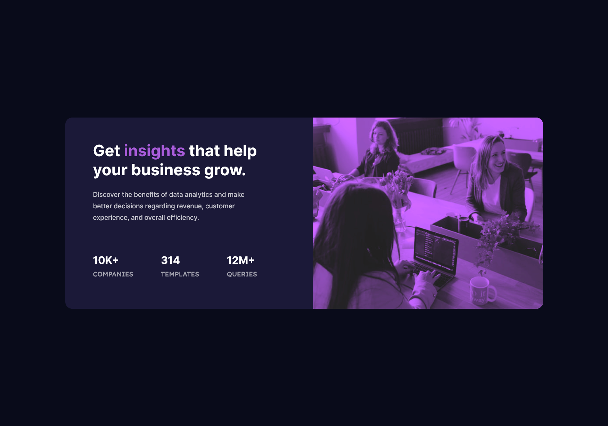

# Frontend Mentor - Stats preview card component solution

This is a solution to the [Stats preview card component challenge on Frontend Mentor](https://www.frontendmentor.io/challenges/stats-preview-card-component-8JqbgoU62). Frontend Mentor challenges help you improve your coding skills by building realistic projects.

## Table of contents

-   [Overview](#overview)
    -   [The challenge](#the-challenge)
    -   [Screenshot](#screenshot)
    -   [Links](#links)
-   [My process](#my-process)
    -   [Built with](#built-with)
    -   [What I learned](#what-i-learned)
    -   [Continued development](#continued-development)

## Overview

### The challenge

Users should be able to:

-   View the optimal layout depending on their device's screen size

### Screenshot



### Links

-   [GitHub Pages](https://satyamvyas04.github.io/LearningFrontEnd/FrontEndMentor/CompanyStatsCard/)

## My process

### Built with

-   Semantic HTML5 markup
-   CSS custom properties
-   Flexbox

### What I learned

Use this section to recap over some of your major learnings while working through this project. Writing these out and providing code samples of areas you want to highlight is a great way to reinforce your own knowledge.

To see how you can add code snippets, see below:

```css
.card .img {
	display: flex;
	align-items: center;
	justify-content: center;
	background-image: url(images/image-header-desktop.jpg);
	background-repeat: no-repeat no-repeat;
	background-color: var(--softVoilet);
	height: 100%;
	width: 200%;
	border-radius: 0 1rem 1rem 0;
	background-blend-mode: multiply;
	filter: brightness(1.25) contrast(0.75) saturate(1.5);
}
```

### Continued development

Making this Responsive
