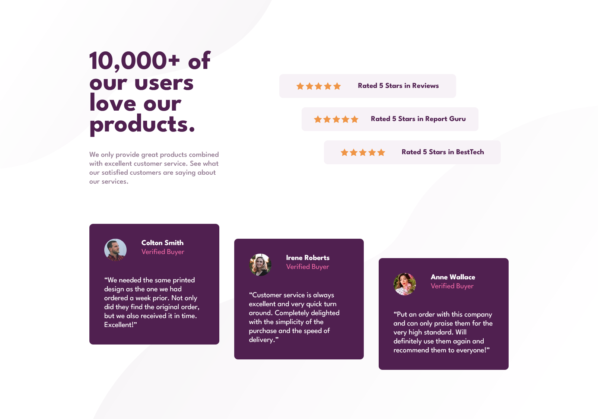

# Frontend Mentor - Social proof section solution

This is a solution to the [Social proof section challenge on Frontend Mentor](https://www.frontendmentor.io/challenges/social-proof-section-6e0qTv_bA). Frontend Mentor challenges help you improve your coding skills by building realistic projects.

## Table of contents

-   [Overview](#overview)
    -   [The challenge](#the-challenge)
    -   [Screenshot](#screenshot)
    -   [Links](#links)
-   [My process](#my-process)
    -   [Built with](#built-with)
    -   [What I learned](#what-i-learned)

## Overview

### The challenge

Users should be able to:

-   View the optimal layout for the section depending on their device's screen size

### Screenshot



### Links

-   [GitHubPages](https://satyamvyas04.github.io/LearningFrontEnd/FrontEndMentor/SocialProofPage/)

## My process

### Built with

-   Semantic HTML5 markup
-   CSS custom properties
-   Flexbox
-   CSS Grid

### What I learned

Use this section to recap over some of your major learnings while working through this project. Writing these out and providing code samples of areas you want to highlight is a great way to reinforce your own knowledge.

To see how you can add code snippets, see below:

```css
.reviews .review {
	display: grid;
	padding: 2rem;
	gap: 2rem;
	width: 100%;
	color: white;
	border-radius: 0.5rem;
	background-color: var(--DarkMagenta);
	grid-template:
		"img name-status"
		"comment comment";
	grid-template-rows: auto auto;
	grid-template-columns: 3rem auto;
	.name-status {
		grid-area: name-status;
		.status {
			color: var(--SoftPink);
		}
	}
	.comment {
		grid-area: comment;
	}
}

.reviews .review img {
	grid-area: img;
	width: 100%;
	border-radius: 50%;
}
```
