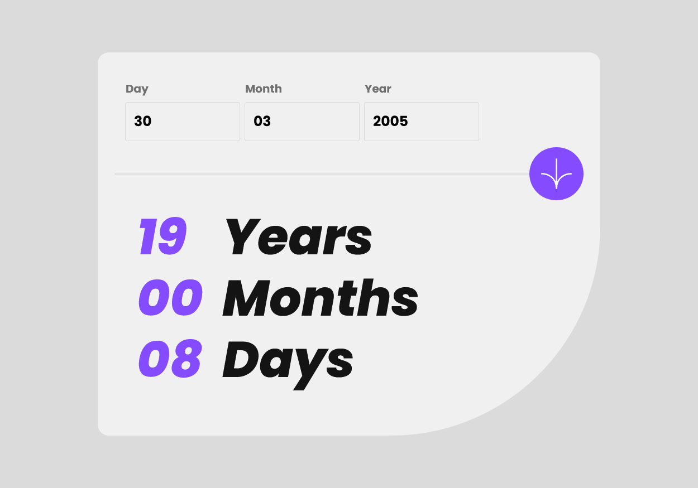

# Frontend Mentor - Age calculator app solution

This is a solution to the [Age calculator app challenge on Frontend Mentor](https://www.frontendmentor.io/challenges/age-calculator-app-dF9DFFpj-Q). Frontend Mentor challenges help you improve your coding skills by building realistic projects.

## Table of contents

-   [Overview](#overview)
    -   [The challenge](#the-challenge)
    -   [Screenshot](#screenshot)
    -   [Links](#links)
-   [My process](#my-process)
    -   [Built with](#built-with)
    -   [What I learned](#what-i-learned)
    -   [Continued development](#continued-development)

## Overview

### The challenge

Users should be able to:

-   View an age in years, months, and days after submitting a valid date through the form
-   Receive validation errors if:
    -   Any field is empty when the form is submitted
    -   The day number is not between 1-31
    -   The month number is not between 1-12
    -   The year is in the future
    -   The date is invalid e.g. 31/04/1991 (there are 30 days in April)
-   View the optimal layout for the interface depending on their device's screen size
-   See hover and focus states for all interactive elements on the page
-   **Bonus**: See the age numbers animate to their final number when the form is submitted

### Screenshot



### Links

-   Github Pages : [Link](https://satyamvyas04-agecalculator.vercel.app/)

## My process

### Built with

-   [React](https://reactjs.org/) - JS library
-   Tailwind

### What I learned

Git to know to validate dates using dayjs and to use the React `useState` React Hook

```js
import dayjs from "dayjs";

const formSubmitAction = (
	day,
	month,
	year,
	setOutputDate,
	setOutputMonth,
	setOutputYear,
	setDayError,
	setMonthError,
	setYearError,
	setDayErrorView,
	setMonthErrorView,
	setYearErrorView,
	setDayHeaderView,
	setMonthHeaderView,
	setYearHeaderView
) => {
	let dflag = false;
	let mflag = false;
	let yflag = false;

	if (day === "") {
		setDayError("This field is required");
		setDayErrorView("opacity-100");
		setDayHeaderView("text-LightRed");
	} else if (day > 31 || day < 1) {
		setDayError("Must be a valid date");
		setDayErrorView("opacity-100");
		setDayHeaderView("text-LightRed");
	} else {
		setDayError("Error Placeholder");
		setDayErrorView("opacity-0");
		setDayHeaderView("text-SmokeyGrey");
		dflag = true;
	}

	if (month === "") {
		setMonthError("This field is required");
		setMonthErrorView("opacity-100");
		setMonthHeaderView("text-LightRed");
	} else if (month > 12 || month < 1) {
		setMonthError("Must be a valid month");
		setMonthErrorView("opacity-100");
		setMonthHeaderView("text-LightRed");
	} else {
		setMonthError("Error Placeholder");
		setMonthErrorView("opacity-0");
		setMonthHeaderView("text-SmokeyGrey");
		mflag = true;
	}

	if (year === "") {
		setYearError("This field is required");
		setYearErrorView("opacity-100");
		setYearHeaderView("text-LightRed");
	} else if (year > new Date().getFullYear()) {
		setYearError("Must be in the past");
		setYearErrorView("opacity-100");
		setYearHeaderView("text-LightRed");
	} else {
		setYearError("Error Placeholder");
		setYearErrorView("opacity-0");
		setYearHeaderView("text-SmokeyGrey");
		yflag = true;
	}

	let result = dayjs(`${month}/${day}/${year}`, "DD/MM/YYYY", true).isValid();

	if (dflag && mflag && yflag) {
		if (!result) {
			setDayError("Must be a valid date");
			setDayErrorView("opacity-100");
			setDayHeaderView("text-LightRed");
		} else {
			setDayError("Error Placeholder");
			setDayErrorView("opacity-0");
			setDayHeaderView("text-SmokeyGrey");

			let dob = dayjs(`${month}/${day}/${year}`, "DD/MM/YYYY", true);
			let today = dayjs();
			let outputYears = today.diff(dob, "year");
			let outputMonths = today.diff(
				dob.add(outputYears, "year"),
				"month"
			);
			let outputDays = today.diff(
				dob.add(outputYears, "year").add(outputMonths, "month"),
				"day"
			);

			setOutputYear(outputYears.toString().padStart(2, "0"));
			setOutputMonth(outputMonths.toString().padStart(2, "0"));
			setOutputDate(outputDays.toString().padStart(2, "0"));
		}
	}
};

export default formSubmitAction;
```

### Continued development

Animations to be added sooon (GSAP)
