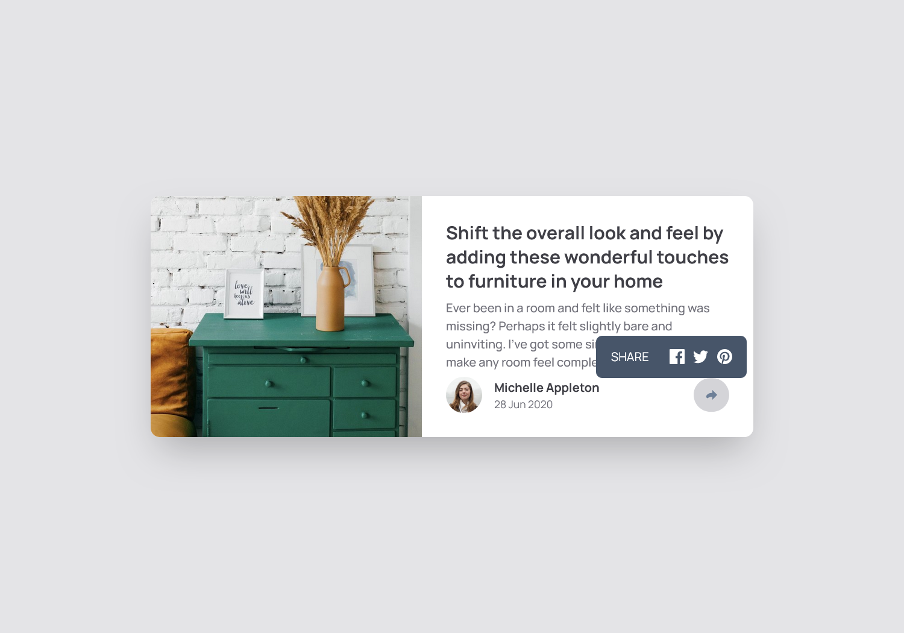

# Frontend Mentor - Article preview component solution

This is a solution to the [Article preview component challenge on Frontend Mentor](https://www.frontendmentor.io/challenges/article-preview-component-dYBN_pYFT). Frontend Mentor challenges help you improve your coding skills by building realistic projects.

## Table of contents

-   [Overview](#overview)
    -   [The challenge](#the-challenge)
    -   [Screenshot](#screenshot)
    -   [Links](#links)
-   [My process](#my-process)
    -   [Built with](#built-with)
    -   [What I learned](#what-i-learned)

## Overview

### The challenge

Users should be able to:

-   View the optimal layout for the component depending on their device's screen size
-   See the social media share links when they click the share icon

### Screenshot



### Links

-   GithubPages: [Link](https://satyamvyas04.github.io/LearningFrontEnd/Projects/ArticlePreview/)

## My process

### Built with

-   HTML
-   Tailwind

### What I learned

Using opacity to play with the transition was fabbb

```js
const share = document.getElementById("sharebutton");
const mob_close = document.getElementById("shareclose");
const hover = document.getElementById("sharehover");

share.addEventListener("click", () => {
	hover.classList.toggle("opacity-100");
});

mob_close.addEventListener("click", () => {
	hover.classList.toggle("opacity-100");
});
```
