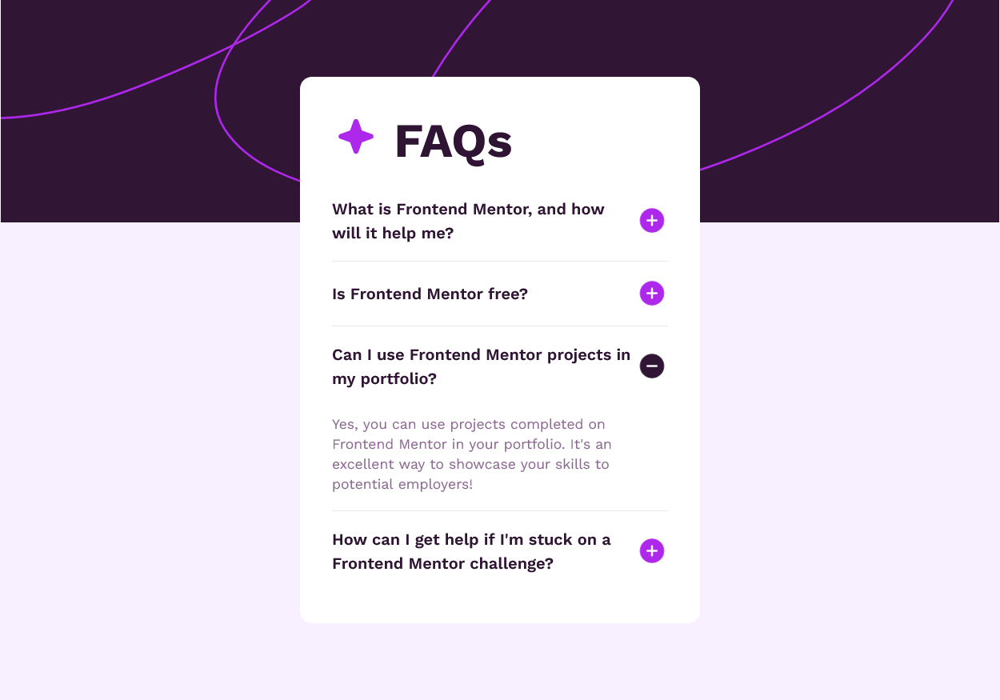

# Frontend Mentor - FAQ accordion solution

This is a solution to the [FAQ accordion challenge on Frontend Mentor](https://www.frontendmentor.io/challenges/faq-accordion-wyfFdeBwBz). Frontend Mentor challenges help you improve your coding skills by building realistic projects.

## Table of contents

-   [Overview](#overview)
    -   [The challenge](#the-challenge)
    -   [Screenshot](#screenshot)
    -   [Links](#links)
-   [My process](#my-process)
    -   [Built with](#built-with)
    -   [What I learned](#what-i-learned)

## Overview

### The challenge

Users should be able to:

-   Hide/Show the answer to a question when the question is clicked
-   Navigate the questions and hide/show answers using keyboard navigation alone
-   View the optimal layout for the interface depending on their device's screen size
-   See hover and focus states for all interactive elements on the page

### Screenshot



### Links

-   Solution URL: [GitHubPages](https://satyamvyas04.github.io/LearningFrontEnd/FrontEndMentor/FAQ-Accordion/)

## My process

### Built with

-   Semantic HTML5 markup
-   Tailwind

### What I learned

Use this section to recap over some of your major learnings while working through this project. Writing these out and providing code samples of areas you want to highlight is a great way to reinforce your own knowledge.

To see how you can add code snippets, see below:

```css
TAILWIND CONFIG FILE

/** @type {import('tailwindcss').Config} */
module.exports = {
	content: ["./dist/**/*.{html,js}"],
	theme: {
		extend: {
			colors: {
				"light-pink": "hsl(275, 100%, 97%)",
				"gray-purple": "hsl(292, 16%, 49%)",
				"dark-purple": "hsl(292, 42%, 14%)",
			},
			fontFamily: {
				worksans: ["Work Sans", "sans serif"],
			},
			backgroundImage: {
				"hero-bg-desktop":
					"url('/dist/images/background-pattern-desktop.svg')",
				"hero-bg-mobile":
					"url('/dist/images/background-pattern-mobile.svg')",
				"acc-plus": "url('/dist/images/icon-plus.svg')",
				"acc-minus": "url('/dist/images/icon-minus.svg')",
				"acc-star": "url('/dist/images/icon-star.svg')",
			},
		},
	},
	plugins: [],
};

```

```js
function expand_contract(btn) {
	let id = btn.id;
	let dd = document.getElementById(`dd${id.charAt(3)}`);
	let active_btns = document.getElementsByClassName("btn-minus");

	if (active_btns.length > 0) {
		if (active_btns[0].id === id) {
		} else {
			let correspondingdd = document.getElementById(
				`dd${active_btns[0].id.charAt(3)}`
			);

			active_btns[0].classList.toggle("btn-minus");
			correspondingdd.classList.toggle("hidden");
		}
	}

	btn.classList.toggle("btn-minus");
	dd.classList.toggle("hidden");
}
```
