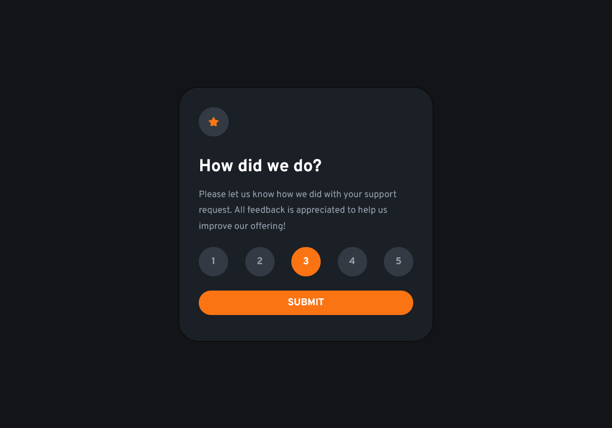

# Frontend Mentor - Interactive rating component solution

This is a solution to the [Interactive rating component challenge on Frontend Mentor](https://www.frontendmentor.io/challenges/interactive-rating-component-koxpeBUmI). Frontend Mentor challenges help you improve your coding skills by building realistic projects.

## Table of contents

-   [Overview](#overview)
    -   [The challenge](#the-challenge)
    -   [Screenshot](#screenshot)
    -   [Links](#links)
-   [My process](#my-process)
    -   [Built with](#built-with)
    -   [What I learned](#what-i-learned)

## Overview

### The challenge

Users should be able to:

-   View the optimal layout for the app depending on their device's screen size
-   See hover states for all interactive elements on the page
-   Select and submit a number rating
-   See the "Thank you" card state after submitting a rating

### Screenshot



### Links

-   [GithubPages](https://satyamvyas04.github.io/LearningFrontEnd/FrontEndMentor/RatingComponent/)

## My process

### Built with

-   Semantic HTML5 markup
-   CSS custom properties
-   Vanilla js
-   Flexbox

### What I learned

I learned how to manipulate the DOM, to take data from input and labels, and to change "pages"
To see how you can add code snippets, see below:

```css
.hidden {
	display: none;
}
```

```js
for (let i = 0; i < ratings.length; i++) {
	let rating = ratings[i];
	rating.addEventListener("click", (e) => {
		ans = labels[i].textContent;
	});
}

submit.addEventListener(
	"click",
	(e) => {
		thanks.classList.remove("hidden");
		home.classList.add("hidden");
		confirm.textContent = `You selected ${ans} out of 5`;
	},
	false
);
```
