# [LearningFrontEnd](https://satyamvyas04.github.io/LearningFrontEnd/)

<h3 align='center'>Static Projects</h3>

  <a href = 'https://satyamvyas04.github.io/LearningFrontEnd/FrontEndMentor/QR%20Code/' >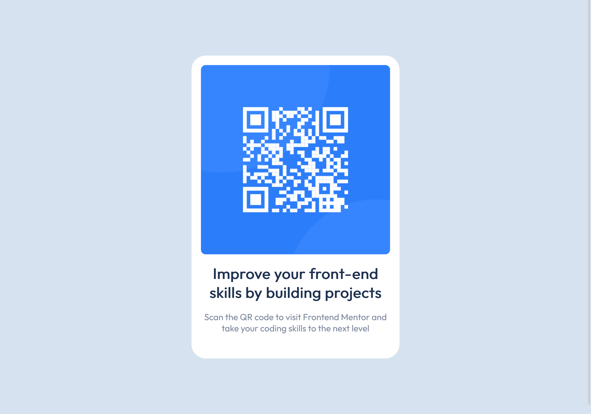</a>
  <a href = "https://satyamvyas04.github.io/LearningFrontEnd/FrontEndMentor/NFTCard/">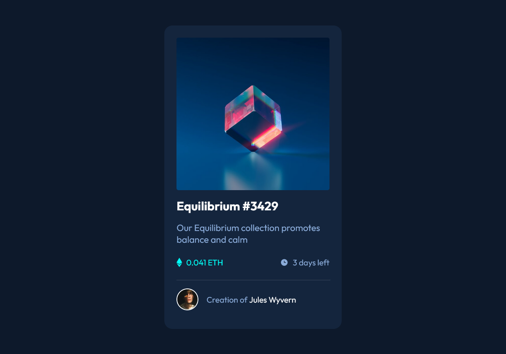</a>
  <a href = "https://satyamvyas04.github.io/LearningFrontEnd/FrontEndMentor/ResultsSummary/">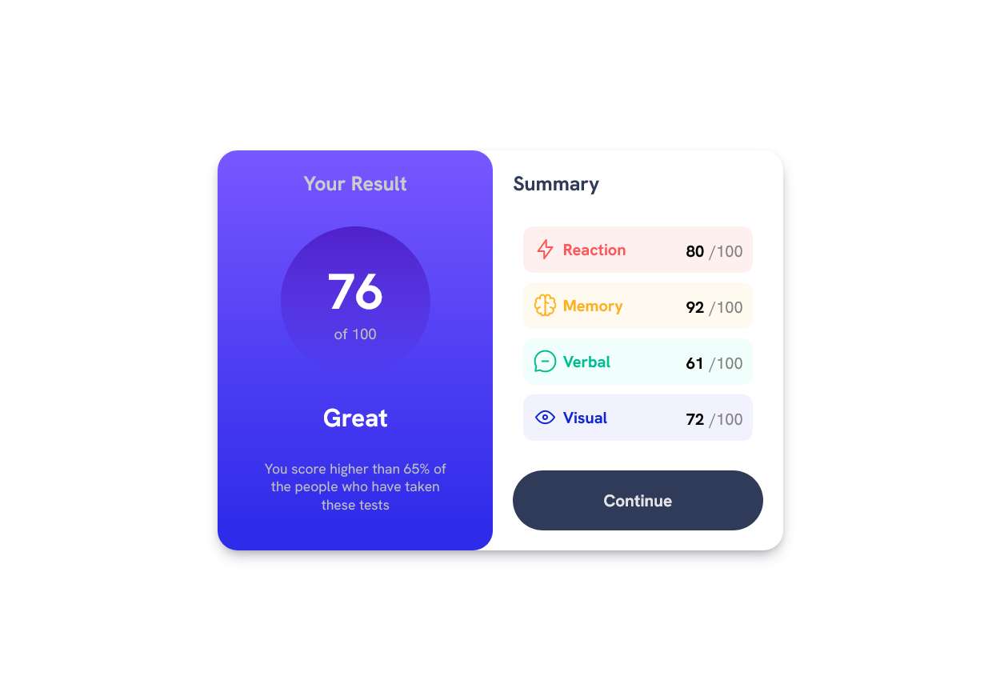</a>
  
  
  
  <a href = "https://satyamvyas04.github.io/LearningFrontEnd/FrontEndMentor/Three-Column/">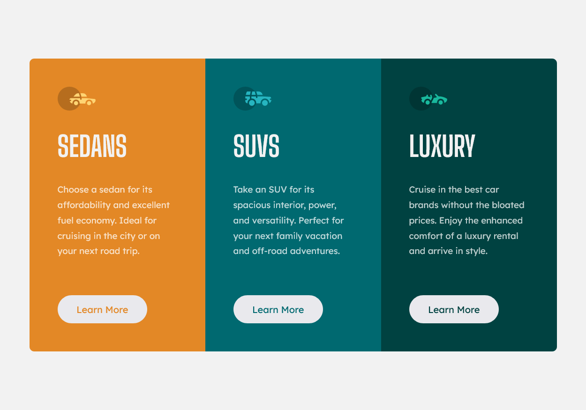</a>
  <a href = "https://satyamvyas04.github.io/LearningFrontEnd/FrontEndMentor/RatingComponent/">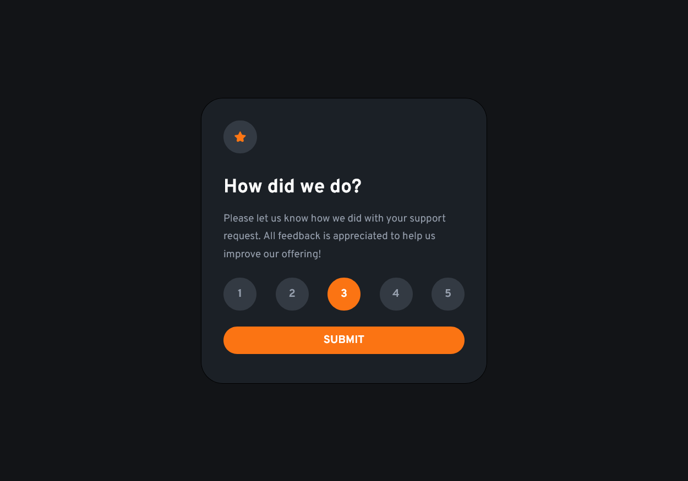</a>
  <a href = "https://satyamvyas04.github.io/LearningFrontEnd/FrontEndMentor/SocialProofPage/">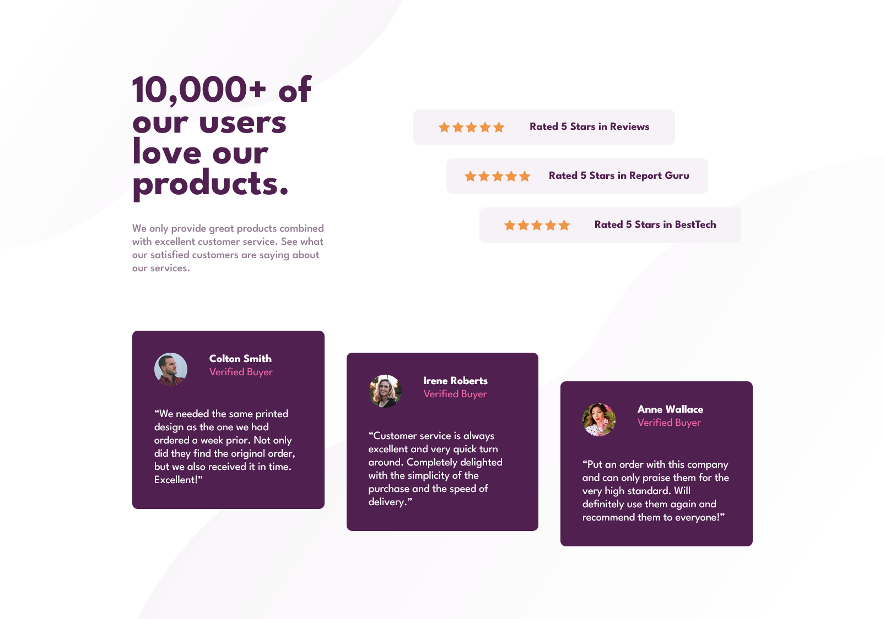</a>

<h3 align='center'>Dynamic Projects</h3>

  

<h3 align='center'>CSS</h3>

  <a href = 'https://satyamvyas04.github.io/LearningFrontEnd/CSSBasics/TypesettingHomePage/main.html' >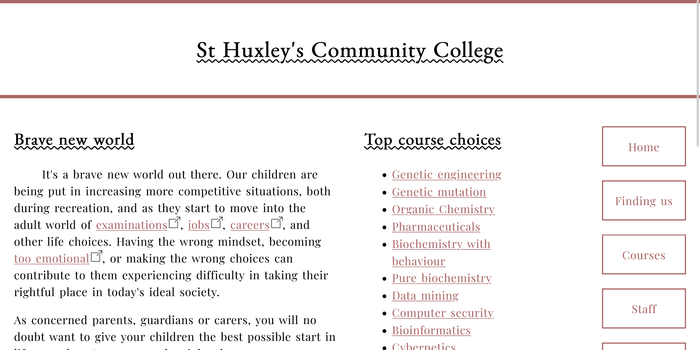</a>
  <a href = 'https://satyamvyas04.github.io/LearningFrontEnd/CSSBasics/ResponsiveWebsite/home.html' >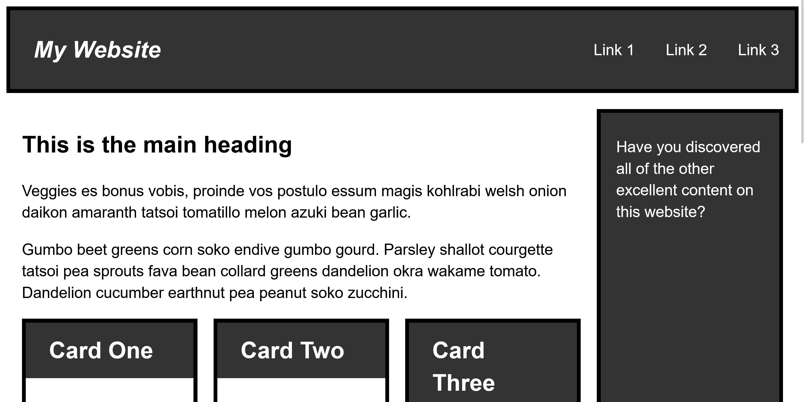</a>
  <a href = 'https://satyamvyas04.github.io/LearningFrontEnd/CSSBasics/WebsiteAssignment/home.html' >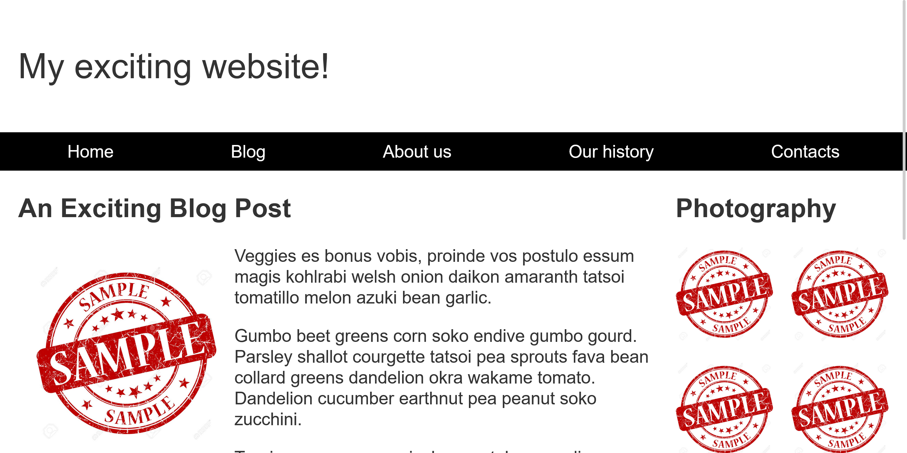</a>

<h3 align='center'>HTML</h3>

  <a href = 'https://satyamvyas04.github.io/LearningFrontEnd/HTMLBasics/Letter/Letter.html' >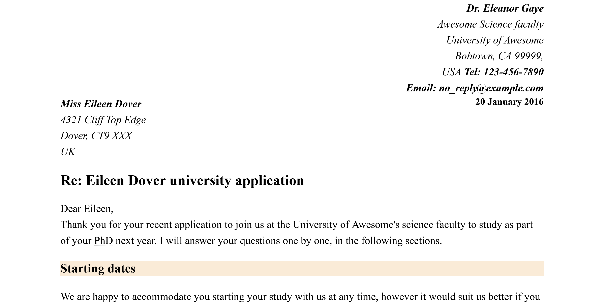</a>
  <a href = 'https://satyamvyas04.github.io/LearningFrontEnd/HTMLBasics/PlanetData/blank-template.html' >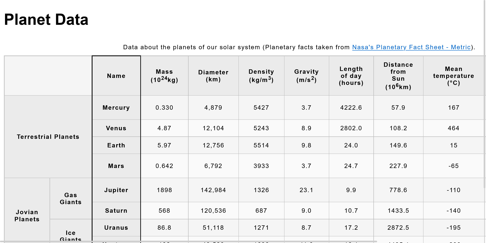</a>
  <a href = 'https://satyamvyas04.github.io/LearningFrontEnd/HTMLBasics/MozillaSplash/index.html' >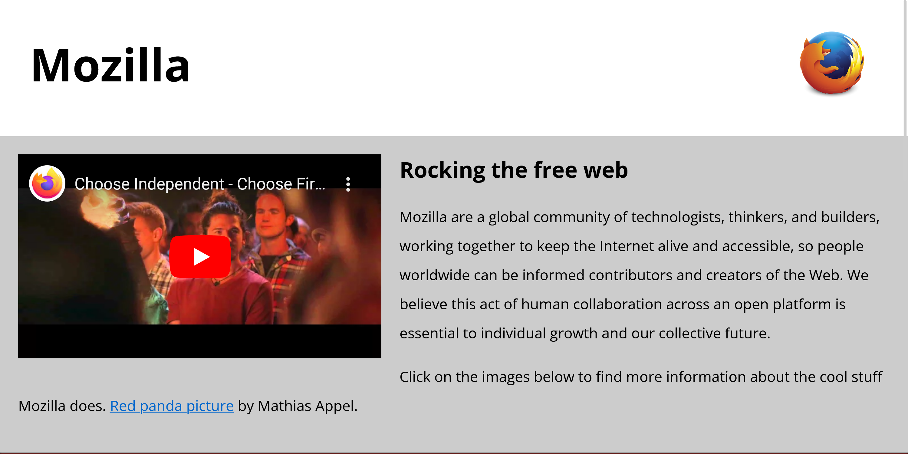</a>

---

## Repository Structure

The repository is organized into three main sections: HTML Basics, CSS Basics, and JS Basics. Each section contains subfolders for various small projects and exercises to help you practice and build your skills gradually.

### HTML Basics

In this section, you'll find projects and exercises related to HTML, the markup language used to structure web content. The projects here will cover essential HTML concepts and provide hands-on experience in creating web pages. For more in-depth information and documentation on HTML, refer to [MDN Web Docs](https://developer.mozilla.org/en-US/docs/Web/HTML).

### CSS Basics

The CSS Basics section focuses on Cascading Style Sheets (CSS), which is used to control the presentation and layout of web pages. You'll work on projects to style HTML elements and make web pages visually appealing. To explore CSS in greater detail and access comprehensive resources, check out [MDN Web Docs](https://developer.mozilla.org/en-US/docs/Web/CSS) and [FreeCodeCamp CSS Videos](https://www.freecodecamp.org/).

### JS Basics

The JS Basics section delves into JavaScript, a powerful programming language that adds interactivity and functionality to web pages. You'll find projects and exercises to help you understand JavaScript's core concepts. For guidance and additional learning materials on JavaScript, refer to [MDN Web Docs](https://developer.mozilla.org/en-US/docs/Web/JavaScript) and [FreeCodeCamp JavaScript Videos](https://www.freecodecamp.org/).

## Contributing

If you have suggestions for improvements or would like to contribute additional learning resources, please feel free to open an issue or submit a pull request. Your contributions are welcome and can help others in their learning journey.

Happy learning, and enjoy your front-end development journey!
